# Lambda Authorizer Benchmarking Tool

> The purpose of this application is to calculate the performance of Lambda Authorizer-enabled serverless functions. It was created as part of the MSc in Cloud Computing Research Project at the National College of Ireland.

## Prerequisites

[NodeJS](http://nodejs.org/) and [NPM](https://npmjs.org/) are required for this project. The installation of them is straightforward. Try running the following command to determine whether they are installed.

```sh
$ npm -v && node -v
8.19.2
v18.11.0
```

The next step is to install the [AWS CLI](https://docs.aws.amazon.com/cli/latest/userguide/getting-started-install.html) and [AWS SAM CLI](https://docs.aws.amazon.com/serverless-application-model/latest/developerguide/install-sam-cli.html). Make sure the [AWS CLI profile](https://docs.aws.amazon.com/cli/latest/userguide/cli-configure-quickstart.html) is configured with an active AWS account. Verify their installations by running the command below.

```sh
$ aws --version && sam --version
aws-cli/2.8.5
SAM CLI, version 1.60.0
```

In order to use perform benchmarking process, the user must install some other programming language runtimes: [Python 3.9](https://realpython.com/installing-python/), [Go 1.x](https://go.dev/doc/install) & [Java 11](https://docs.oracle.com/en/java/javase/11/install/overview-jdk-installation.html). In addition to Java, the user needs to install [Maven](https://maven.apache.org/install.html) as well. Run the command below to verify it.

```sh
$ python --version && go version
Python 3.9.14
go1.19.2

$ java -version && mvn -version
openjdk64-11.0.11
Apache Maven 3.8.6
```

## Table of Contents

- [Project Name](#lambda-authorizer-benchmarking-tool)
  - [Prerequisites](#prerequisites)
  - [Table of Contents](#table-of-contents)
  - [Getting Started](#getting-started)
  - [Development Environment](#development-environment)
  - [Installation](#installation)
    - [Dependencies](#dependencies)
  - [Usage](#usage)
    - [Option Help](#option-help)
    - [Option Clean](#option-clean)
    - [Option Deploy](#option-deploy)
    - [Option Test](#option-test)
    - [Option Report](#option-report)
    - [Option Logs Insight](#option-logs-insight)
    - [Combination of Options](#combination-of-options)
  - [Configurations](#configurations)
    - [Artillery](#artillery)
      - [Templates](#templates)
    - [Logs Insight](#logs-insight)
  - [Reports](#reports)
    - [Artillery](#artillery-1)
    - [Logs Insight](#logs-insight-1)
  - [Versioning](#versioning)
  - [Authors](#authors)
  - [License](#license)

## Getting Started

For development and testing purposes, follow these instructions to get the project up and running on the local machine.

## Development Environment

The author's machine and system are described below.


```sh
$ system_profiler SPSoftwareDataType
System Software Overview:

      System Version: macOS 13.0 (22A380)
      Kernel Version: Darwin 22.1.0
      Boot Volume: Macintosh HD
      Boot Mode: Normal
      Secure Virtual Memory: Enabled
      System Integrity Protection: Enabled
```

## Installation

**BEFORE INSTALATION:** Please read the [prerequisites](#prerequisites).

The first step is to clone this repo locally:

```sh
$ git clone https://github.com/cornelius-tyranade/lambda-authorizer-benchmarking-tool.git
$ cd lambda-authorizer-benchmarking-tool
```

### Dependencies

The [package.json](package.json) file contains a list of dependencies that will be installed. Below are the dependencies used short explanation and the source of each dependency:

1. [Artillery.](https://www.npmjs.com/package/artillery) Perform multiple performance tests quickly.
2. [Command-exists-promise.](https://www.npmjs.com/package/command-exists-promise) Verify if a specific command exists in the system.
3. [Commander.](https://www.npmjs.com/package/commander) Quick solution for NodeJs command-line interfaces.
4. [Config.](https://www.npmjs.com/package/config) Simple key-values file configuration manager.
5. [Replace-in-file.](https://www.npmjs.com/package/replace-in-file) Replace text synchronously in one or more files.
6. [ShellJS.](https://www.npmjs.com/package/shelljs) Call shell commands in NodeJs application.

The NodeJS application dependencies need to be installed and set up as follows:

```sh
$ npm install
```

## Usage

### Option Help

This option explains what feature options are available in the Lambda Authorizer Benchmarking Tool.

```
$ node labt -h
Usage: labt [options]

===================================
Lambda Authorizer Benchmarking Tool
===================================

Options:
  -v, --version                        display version
  -c, --clean                          remove current stack if exist
  -d, --deploy                         start the deployment process
  -t, --test [identifers...]           start the performance test
  -r, --report [identifers...]         generate Artillery performance test report in HTML
  -li, --logs-insight [identifers...]  generate AWS CloudWatch logs insight query result in JSON
  -h, --help                           display help for command
```

### Option Clean

This option is used to erase the current stack installed in the Lambda application.

```sh
$ node labt -c
```

It also logs the erasing process into `serverless-apps-builder/logs` folder as [stage_delete.txt](serverless-apps-builder/logs/stage_delete.txt).

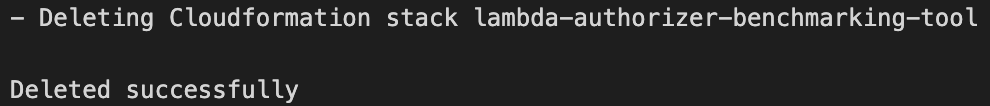

### Option Deploy

This option deploys all scenarios according to what is written in the template.yaml after building the scenarios code.

```sh
$ node labt -d
```

Upon completion, each scenario's URLs and identifiers are extracted into [urls.json](serverless-apps-builder/logs/urls.json) and [identifiers.json](serverless-apps-builder/logs/identifiers.json), respectively.

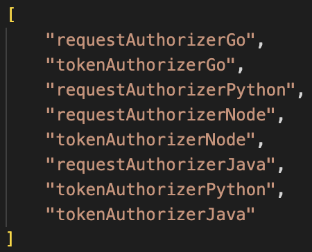

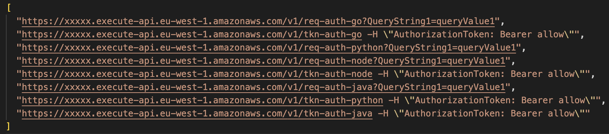

Also, [stage_build.txt](serverless-apps-builder/logs/stage_build.txt) and [stage_deploy.txt](serverless-apps-builder/logs/stage_deploy.txt) log files are generated during this process.

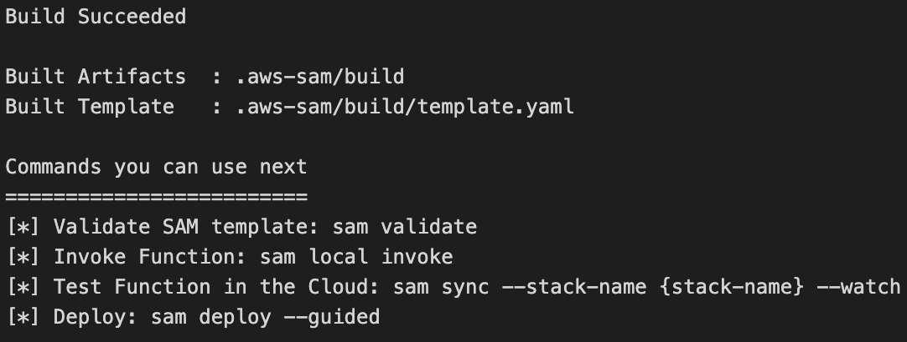

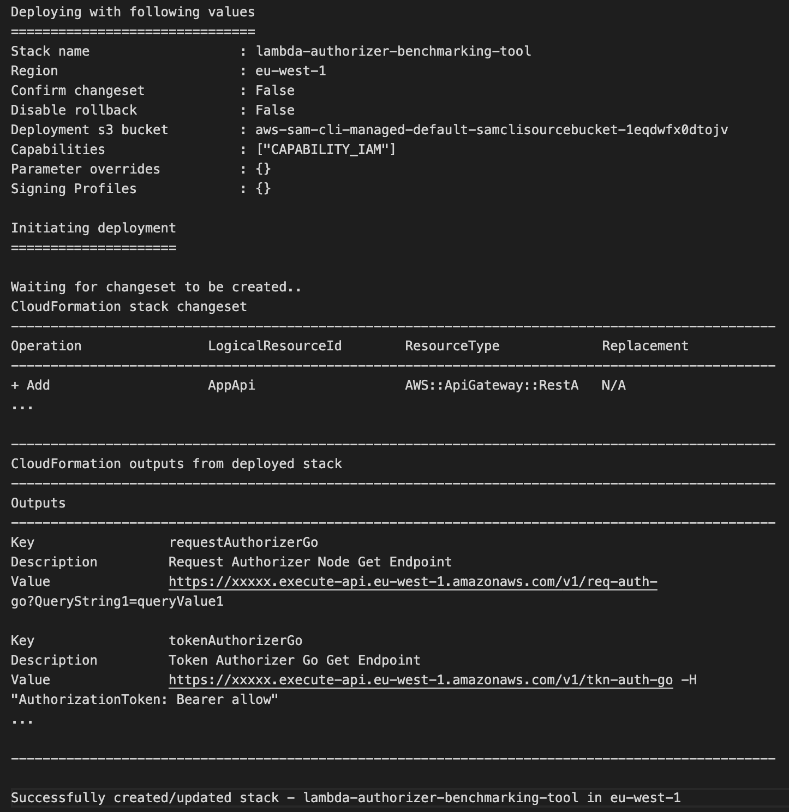

### Option Test

This option instructs the system to run performance testing repeatedly for a certain duration. The duration and rate of performance testing can be set from within the [default.json](config/default.json) file in the `config` folder. As an example, the duration and rate values are ten. The system will call the function ten times a second for ten seconds.

```sh
$ node labt -t
$ node labt -t "tokenAuthorizerPython"
$ node labt -t "requestAuthorizerPython" "tokenAuthorizerPython"
```

It also generated Artillery configuration in `config/artillery` folder. One of the examples is [requestAuthorizerGo.yml](config/artillery/requestAuthorizerGo.yml)

```yml
config:
  target: https://xxxxx.execute-api.eu-west-1.amazonaws.com/v1/
  phases:
    - duration: 10
      arrivalRate: 10
      name: benchmarking

scenarios:
  - name: requestAuthorizerGo
    flow:
      - get:
          url: /req-auth-go?QueryString1=queryValue1
          expect:
            - statusCode: 200
```

The output of this process is placed in the `outputs/artillery` folder in JSON form. For instance, [requestAuthorizerGo.json](outputs/artillery/requestAuthorizerGo.json).


### Option Report

Using this option, it will generate an HTML report using the JSON file in `outputs/artillery`.

```sh
$ node labt -r
$ node labt -r "tokenAuthorizerNode"
$ node labt -r "requestAuthorizerNode" "tokenAuthorizerNode"
```

Report HTML generation result can be found in section [report](#artillery-1).

### Option Logs Insight

The AWS CloudWatch logs record each function' activities when the user run performance tests. This option queries several important output parameters from logs, such as init/cold duration, warm duration, and also memory used. The results of this output are placed in the `outputs/logs_insight folder`.

```sh
$ node labt -li
$ node labt -li "tokenAuthorizerGo"
$ node labt -li "tokenAuthorizerGo" "tokenAuthorizerJava"
```

Two files are generated as a result. One contains the [query identifier](outputs/logs_insight/query_id_overview.json), and the other contains the [results](outputs/logs_insight/query_result_overview.json). Below is a sample of the Logs Insight query:

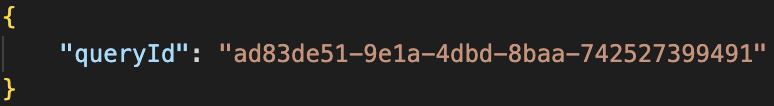

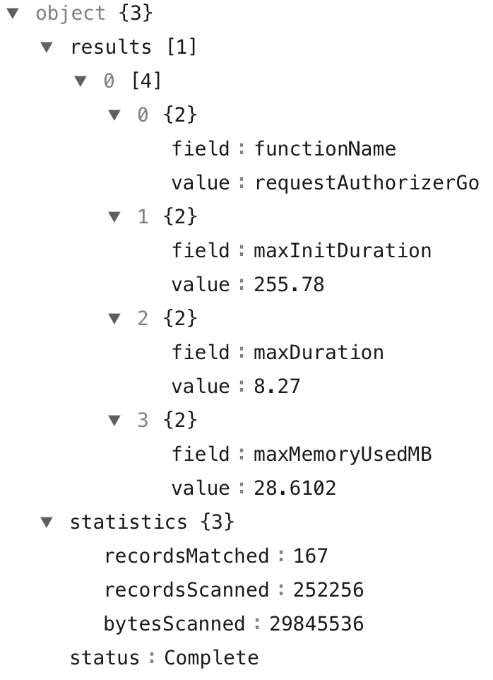

### Combination of Options

This application can accept flag combinations of more than one input. With the following command, the user can do a clean deployment, then run the test and create an HTML report, as well as generate the results of a Logs Insight query at once.

```sh
$ node labt -c -d -t -r -li
```

## Configurations

To simplify setting application variables, the author separated the configuration settings into a file called [default.json](config/default.json) within the `config` directory.

### Artillery

1. Variable artillery.duration determines how long the performance test runs for each scenario.
2. Variable artillery.rate specifies how many API calls are in one second.

```json
{
  "artillery": {
    "duration": 10,
    "rate": 10
  }
}
```

#### Templates

When the user runs the option test, the application will generate Artillery configurations in the `folder/artillery` based on the two templates provided, [artillery_request.yml]() and [artillery_token.yml]().

```yml
#artillery_request.yml
config:
  target: ${endpoint}
  phases:
    - duration: ${duration}
      arrivalRate: ${rate}
      name: benchmarking

scenarios:
  - name: ${identifier}
    flow:
      - get:
          url: ${postfix-url}?QueryString1=queryValue1
          expect:
            - statusCode: 200

#artillery_token.yml
config:
  target: ${endpoint}
  phases:
    - duration: ${duration}
      arrivalRate: ${rate}
      name: benchmarking

scenarios:
  - name: ${identifier}
    flow:
      - get:
          url: ${postfix-url}
          headers:
            AuthorizationToken: "Bearer allow"
          expect:
            - statusCode: 200
```

### Logs Insight

1. Variable logsInsight.timeRange decides how many minutes before the current time are in order to fetch the logs.
2. Variable logsInsight.waitTimeQuery sets the waiting time before getting actual Logs Insight query results.

```json
{
  "artillery": {
    "duration": 10,
    "rate": 10
  }
}
```

## Reports

This section displays and explains the report output from the options test and Log Insights.

### Artillery

Artillery HTML generation result sample can be found in `outputs/artillery`. One of the most important outputs in this HTML is response time. This result is basically the sum of the performance calculation of calling a Lamba Authorizer-enabled serverless function.Below is the example from [requestAuthorizerGo.json.html](outputs/artillery/requestAuthorizerGo.json.html):


### Logs Insight

Logs Insight queries generate seven query results:

1. Request-Token Access Control Overview Query (sorted by function name).

   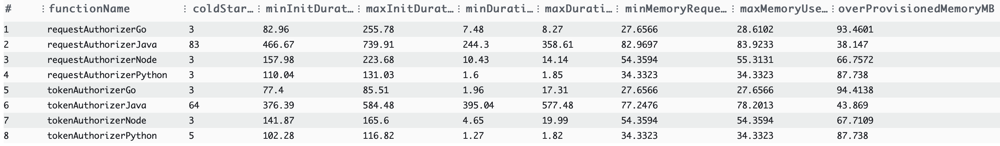

2. Request Access Controlled Max Init Duration Query (in miliseconds).

   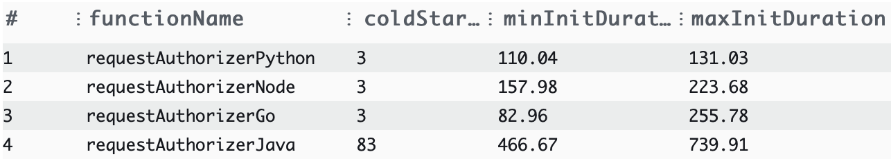

3. Request Access Control Max Duration Query (in miliseconds).

   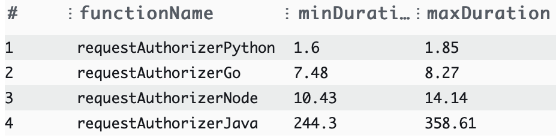

4. Request Access Control Max Used Memory Query (in MB).

   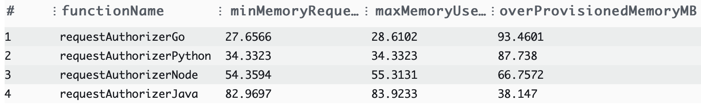

5. Token Access Control Max Init Duration Query (in miliseconds).

   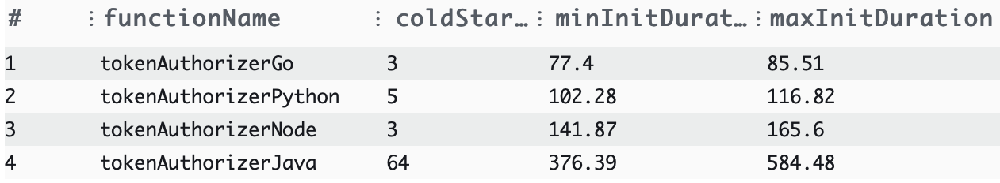

6. Token Access Control Max Duration Query (in miliseconds).

   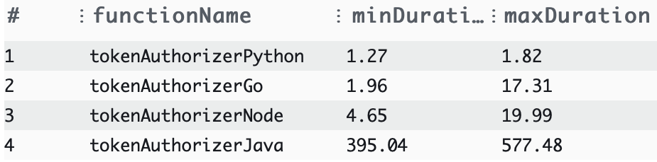

7. Token Access Control Max Used Memory Query (in MB).

   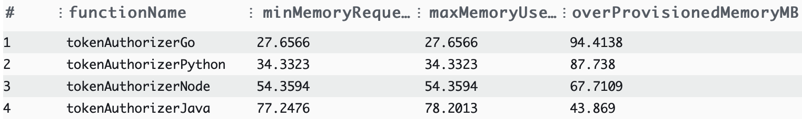

## Authors

- **Cornelius** - _Initial work_ - [cornelius-tyranade](https://github.com/cornelius-tyranade) - x21126747@student.ncirl.ie

## License

[Attribution-NonCommercial-ShareAlike 3.0 Ireland](LICENSE.md)
