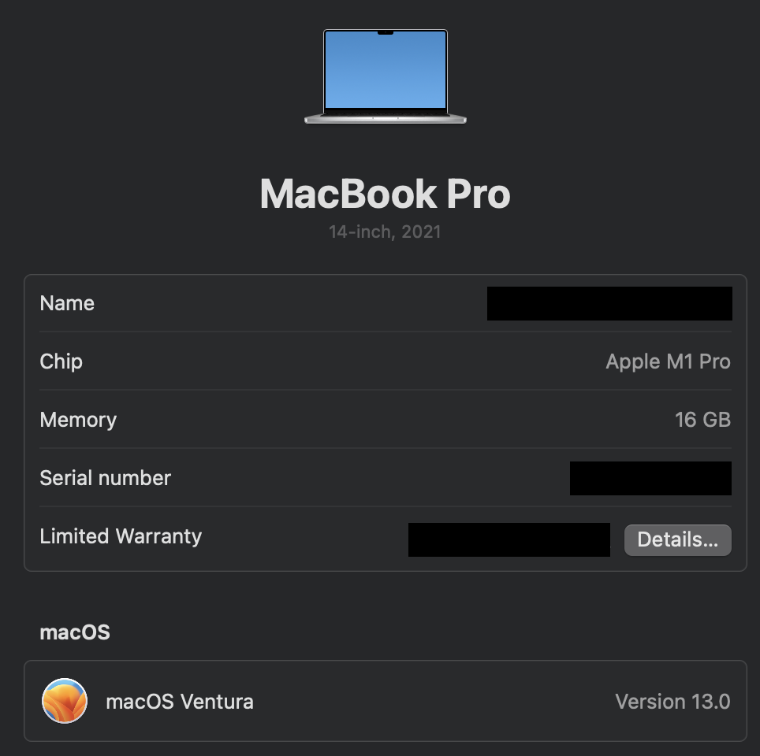
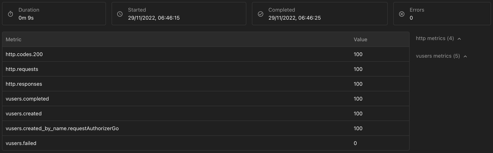
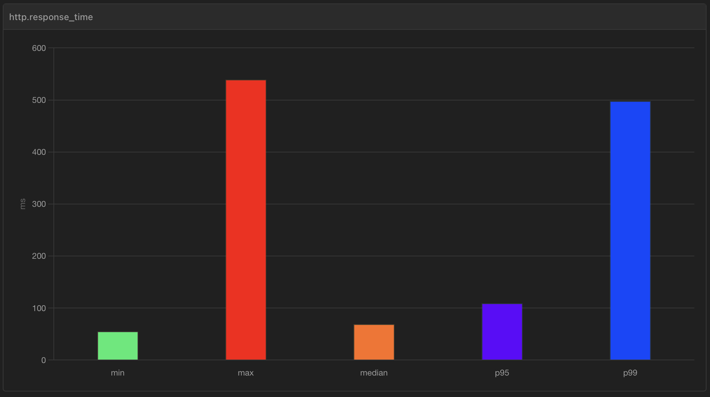

# Lambda Authorizer Benchmarking Tool

> The purpose of this application is to calculate the performance of Lambda Authorizer-enabled serverless functions. It was created as part of the MSc in Cloud Computing Research Project at the National College of Ireland.

## Prerequisites

[NodeJS](http://nodejs.org/) and [NPM](https://npmjs.org/) are required for this project. The installation of them is straightforward. Try running the following command to determine whether they are installed.

```sh
$ npm -v && node -v
8.19.2
v18.11.0
```

The next step is to install the [AWS CLI](https://docs.aws.amazon.com/cli/latest/userguide/getting-started-install.html) and [AWS SAM CLI](https://docs.aws.amazon.com/serverless-application-model/latest/developerguide/install-sam-cli.html). Make sure the [AWS CLI profile](https://docs.aws.amazon.com/cli/latest/userguide/cli-configure-quickstart.html) is configured with an active AWS account. Verify their installations by running the command below.

```sh
$ aws --version && sam --version
aws-cli/2.8.5
SAM CLI, version 1.60.0
```

In order to use perform benchmarking process, the user must install some other programming language runtimes: [Python 3.9](https://realpython.com/installing-python/), [Go 1.x](https://go.dev/doc/install) & [Java 11](https://docs.oracle.com/en/java/javase/11/install/overview-jdk-installation.html). In addition to Java, the user needs to install [Maven](https://maven.apache.org/install.html) as well. Run the command below to verify it.

```sh
$ python --version && go version
Python 3.9.14
go1.19.2

$ java -version && mvn -version
openjdk64-11.0.11
Apache Maven 3.8.6
```

## Table of Contents

- [Project Name](#lambda-authorizer-benchmarking-tool)
  - [Prerequisites](#prerequisites)
  - [Table of Contents](#table-of-contents)
  - [Getting Started](#getting-started)
  - [Development Environment](#development-environment)
  - [Installation](#installation)
    - [Dependencies](#dependencies)
    - [AWS SAM Configurations](#aws-sam-configurations)
  - [Usage](#usage)
    - [Option Help](#option-help)
    - [Option Version](#option-version)
    - [Option Clean](#option-clean)
    - [Option Deploy](#option-deploy)
    - [Option Test](#option-test)
    - [Option Report](#option-report)
    - [Option Logs Insight](#option-logs-insight)
    - [Combination of Options](#combination-of-options)
  - [Configurations](#configurations)
    - [Artillery](#artillery)
      - [Templates](#templates)
    - [Logs Insight](#logs-insight)
  - [Reports](#reports)
    - [Artillery](#artillery-1)
    - [Logs Insight](#logs-insight-1)
  - [Advanced Topics](#advanced-topics)
    - [Add/Modify New Runtime Scenarios](#addmodify-new-runtime-scenarios)
    - [Modify Artillery Performance Test Tests](#modify-artillery-performance-tests)
    - [Add/Modify Logs Insight Queries](#addmodify-logs-insight-queries)
  - [Authors](#authors)
  - [License](#license)

## Getting Started

For development and testing purposes, follow these instructions to get the project up and running on the local machine.

## Development Environment

The author's machine and system are described below.



```sh
$ system_profiler SPSoftwareDataType
System Software Overview:

System Version: macOS 13.0 (22A380)
Kernel Version: Darwin 22.1.0
Boot Volume: Macintosh HD
Boot Mode: Normal
Secure Virtual Memory: Enabled
System Integrity Protection: Enabled
```

## Installation

**BEFORE INSTALATION:** Please read the [prerequisites](#prerequisites).

The first step is to clone this repo locally:

```sh
$ git clone https://github.com/cornelius-tyranade/lambda-authorizer-benchmarking-tool.git
$ cd lambda-authorizer-benchmarking-tool
```

### Dependencies

The [package.json](package.json) file contains a list of dependencies that will be installed. Below are the dependencies used short explanation and the source of each dependency:

1. [Artillery.](https://www.npmjs.com/package/artillery) Perform multiple performance tests quickly.
2. [Command-exists-promise.](https://www.npmjs.com/package/command-exists-promise) Verify if a specific command exists in the system.
3. [Commander.](https://www.npmjs.com/package/commander) Quick solution for NodeJs command-line interfaces.
4. [Config.](https://www.npmjs.com/package/config) Simple key-values file configuration manager.
5. [Replace-in-file.](https://www.npmjs.com/package/replace-in-file) Replace text synchronously in one or more files.
6. [ShellJS.](https://www.npmjs.com/package/shelljs) Call shell commands in NodeJs application.

The NodeJS application dependencies need to be installed and set up as follows:

```sh
$ npm install
```

### AWS SAM Configurations

This application uses AWS SAM as serverless application builder, so the user need to run below command to configure [samconfig.toml](serverless-apps-builder/samconfig.toml).

```sh
$ sam deploy --guided

Configuring SAM deploy
======================

Looking for config file [samconfig.toml] :  Found
Reading default arguments  :  Success

Setting default arguments for 'sam deploy'
=========================================
Stack Name [lambda-authorizer-benchmarking-tool]:
AWS Region [eu-west-1]:
#Shows you resources changes to be deployed and require a 'Y' to initiate deploy
Confirm changes before deploy [Y/n]: Y
#SAM needs permission to be able to create roles to connect to the resources in your template
Allow SAM CLI IAM role creation [Y/n]: Y
#Preserves the state of previously provisioned resources when an operation fails
Disable rollback [y/N]: N
Save arguments to configuration file [Y/n]: Y
SAM configuration file [samconfig.toml]:
SAM configuration environment [default]:
```

However, do not type "Y" when the terminal asks to start deployment. Leave the input blank, and the capital letter value will be used by default.

```sh
Previewing CloudFormation changeset before deployment
======================================================
Deploy this changeset? [y/N]:
```

Alternatively, the user can directly modify existing [samconfig.toml](serverless-apps-builder/samconfig.toml).

```toml
version = 0.1
[default]
[default.deploy]
[default.deploy.parameters]
stack_name = "lambda-authorizer-benchmarking-tool"
s3_bucket = "aws-sam-cli-managed-default-samclisourcebucket-xxxxx"
s3_prefix = "lambda-authorizer-benchmarking-tool"
region = "eu-west-1"
confirm_changeset = true
capabilities = "CAPABILITY_IAM"
image_repositories = []
```

## Usage

### Option Help

This option explains what feature options are available in the Lambda Authorizer Benchmarking Tool.

```
$ node labt -h
Usage: labt [options]

===================================
Lambda Authorizer Benchmarking Tool
===================================

Options:
  -v, --version                        display version
  -c, --clean                          remove current stack if exist
  -d, --deploy                         start the deployment process
  -t, --test [identifers...]           start the performance test
  -r, --report [identifers...]         generate Artillery performance test report in HTML
  -li, --logs-insight [identifers...]  generate AWS CloudWatch logs insight query result in JSON
  -h, --help                           display help for command
```

### Option Version

Lambda Authorizer Benchmarking Tool version can be found by selecting this option.

```sh
$ node labt -v
```

### Option Clean

This option is used to erase the current stack installed in the Lambda application.

```sh
$ node labt -c
```

It also logs the erasing process into `serverless-apps-builder/logs` folder as [stage_delete.txt](serverless-apps-builder/logs/stage_delete.txt).

### Option Deploy

This option deploys all scenarios according to what is written in the template.yaml after building the scenarios code.

```sh
$ node labt -d
```

Upon completion, each scenario's URLs and identifiers are extracted into [urls.json](serverless-apps-builder/logs/urls.json) and [identifiers.json](serverless-apps-builder/logs/identifiers.json), respectively.

```json
[
  "https://xxxxx.execute-api.eu-west-1.amazonaws.com/v1/req-auth-go?QueryString1=queryValue1",
  "https://xxxxx.execute-api.eu-west-1.amazonaws.com/v1/tkn-auth-go -H \"AuthorizationToken: Bearer allow\"",
  "https://xxxxx.execute-api.eu-west-1.amazonaws.com/v1/req-auth-python?QueryString1=queryValue1",
  "https://xxxxx.execute-api.eu-west-1.amazonaws.com/v1/req-auth-node?QueryString1=queryValue1",
  "https://xxxxx.execute-api.eu-west-1.amazonaws.com/v1/tkn-auth-node -H \"AuthorizationToken: Bearer allow\"",
  "https://xxxxx.execute-api.eu-west-1.amazonaws.com/v1/req-auth-java?QueryString1=queryValue1",
  "https://xxxxx.execute-api.eu-west-1.amazonaws.com/v1/tkn-auth-python -H \"AuthorizationToken: Bearer allow\"",
  "https://xxxxx.execute-api.eu-west-1.amazonaws.com/v1/tkn-auth-java -H \"AuthorizationToken: Bearer allow\""
]
```

```json
[
  "requestAuthorizerGo",
  "tokenAuthorizerGo",
  "requestAuthorizerPython",
  "requestAuthorizerNode",
  "tokenAuthorizerNode",
  "requestAuthorizerJava",
  "tokenAuthorizerPython",
  "tokenAuthorizerJava"
]
```

Also, [stage_build.txt](serverless-apps-builder/logs/stage_build.txt) and [stage_deploy.txt](serverless-apps-builder/logs/stage_deploy.txt) log files are generated during this process.

```
Build Succeeded

Built Artifacts  : .aws-sam/build
Built Template   : .aws-sam/build/template.yaml

Commands you can use next
=========================
[*] Validate SAM template: sam validate
[*] Invoke Function: sam local invoke
[*] Test Function in the Cloud: sam sync --stack-name {stack-name} --watch
[*] Deploy: sam deploy --guided
```

```
Deploying with following values
===============================
Stack name                   : lambda-authorizer-benchmarking-tool
Region                       : eu-west-1
Confirm changeset            : False
Disable rollback             : False
Deployment s3 bucket         : aws-sam-cli-managed-default-samclisourcebucket-xxxxx
Capabilities                 : ["CAPABILITY_IAM"]
Parameter overrides          : {}
Signing Profiles             : {}

Initiating deployment
=====================

Waiting for changeset to be created..
CloudFormation stack changeset
-------------------------------------------------------------------------------------------------
Operation                LogicalResourceId        ResourceType             Replacement
-------------------------------------------------------------------------------------------------
+ Add                    AppApi                   AWS::ApiGateway::RestA   N/A
                                                  pi
...

-------------------------------------------------------------------------------------------------
CloudFormation outputs from deployed stack
-------------------------------------------------------------------------------------------------
Outputs
-------------------------------------------------------------------------------------------------
Key                 requestAuthorizerGo
Description         Request Authorizer Node Get Endpoint
Value               https://xxxxx.execute-api.eu-west-1.amazonaws.com/v1/req-auth-
go?QueryString1=queryValue1

Key                 tokenAuthorizerGo
Description         Token Authorizer Go Get Endpoint
Value               https://xxxxx.execute-api.eu-west-1.amazonaws.com/v1/tkn-auth-go -H
"AuthorizationToken: Bearer allow"
...

-------------------------------------------------------------------------------------------------

Successfully created/updated stack - lambda-authorizer-benchmarking-tool in eu-west-1
```

### Option Test

This option instructs the system to run performance testing repeatedly for a certain duration. The duration and rate of performance testing can be set from within the [default.json](config/default.json) file in the `config` folder. As an example, the duration and rate values are ten. The system will call the function ten times a second for ten seconds.

```sh
$ node labt -t
$ node labt -t "tokenAuthorizerPython"
$ node labt -t "requestAuthorizerPython" "tokenAuthorizerPython"
```

It also generated Artillery configuration in `config/artillery` folder. One of the examples is [requestAuthorizerGo.yml](config/artillery/requestAuthorizerGo.yml)

```yml
config:
  target: https://xxxxx.execute-api.eu-west-1.amazonaws.com/v1/
  phases:
    - duration: 10
      arrivalRate: 10
      name: benchmarking

scenarios:
  - name: requestAuthorizerGo
    flow:
      - get:
          url: /req-auth-go?QueryString1=queryValue1
          expect:
            - statusCode: 200
```

The output of this process is placed in the `outputs/artillery` folder in JSON form. For instance, [requestAuthorizerGo.json](outputs/artillery/requestAuthorizerGo.json).

```json
{
  "aggregate": {
    ...
    "firstCounterAt": 1669747575150,
    "firstHistogramAt": 1669747575742,
    "lastCounterAt": 1669747585079,
    "lastHistogramAt": 1669747585079,
    "firstMetricAt": 1669747575150,
    "lastMetricAt": 1669747585079,
    "period": 1669747580000,
    "summaries": {
      "http.response_time": {
        "min": 55,
        "max": 539,
        "count": 100,
        "p50": 68.7,
        "median": 68.7,
        "p75": 85.6,
        "p90": 94.6,
        "p95": 108.9,
        "p99": 497.8,
        "p999": 497.8
      },
      "vusers.session_length": {
        "min": 95.1,
        "max": 595.8,
        "count": 100,
        "p50": 115.6,
        "median": 115.6,
        "p75": 130.3,
        "p90": 144,
        "p95": 156,
        "p99": 584.2,
        "p999": 584.2
      }
    },
  },
  ...
}
```

### Option Report

Using this option, it will generate an HTML report using the JSON file in `outputs/artillery`.

```sh
$ node labt -r
$ node labt -r "tokenAuthorizerNode"
$ node labt -r "requestAuthorizerNode" "tokenAuthorizerNode"
```

Report HTML generation result can be found in section [report](#artillery-1).

### Option Logs Insight

The AWS CloudWatch logs record each function' activities when the user run performance tests. This option queries several important output parameters from logs, such as init/cold duration, warm duration, and also memory used. The results of this output are placed in the `outputs/logs_insight` folder.

```sh
$ node labt -li
$ node labt -li "tokenAuthorizerGo"
$ node labt -li "tokenAuthorizerGo" "tokenAuthorizerJava"
```

Two files are generated as a result. One contains the [query identifier](outputs/logs_insight/query_id_overview.json), and the other contains the [results](outputs/logs_insight/query_result_overview.json). Below is a sample of the Logs Insight query:

```json
{
  "queryId": "ad83de51-9e1a-4dbd-8baa-742527399491"
}
```

```json
{
  "results": [
    [
      {
        "field": "functionName",
        "value": "requestAuthorizerGo"
      },
      {
        "field": "memorySize",
        "value": "128"
      },
      {
        "field": "coldStarts",
        "value": "3"
      },
      {
        "field": "minInitDuration",
        "value": "82.96"
      },
      {
        "field": "maxInitDuration",
        "value": "255.78"
      },
      {
        "field": "minDuration",
        "value": "7.48"
      },
      {
        "field": "maxDuration",
        "value": "8.27"
      },
      {
        "field": "minMemoryUsedMB",
        "value": "27.6566"
      },
      {
        "field": "maxMemoryUsedMB",
        "value": "28.6102"
      },
      {
        "field": "overProvisionedMemoryMB",
        "value": "93.4601"
      }
    ],
    ...
  ],
  "statistics": {
    "recordsMatched": 167.0,
    "recordsScanned": 252256.0,
    "bytesScanned": 29845536.0
  },
  "status": "Complete"
}
```

### Combination of Options

This application can accept flag combinations of more than one input. With the following command, the user can do a clean deployment, then run the test and create an HTML report, as well as generate the results of a Logs Insight query at once.

```sh
$ node labt -c -d -t -r -li
```

## Configurations

To simplify setting application variables, the author separated the configuration settings into a file called [default.json](config/default.json) within the `config` directory.

### Artillery

1. Variable artillery.duration determines how long the performance test runs for each scenario.
2. Variable artillery.rate specifies how many API calls are in one second.

```json
{
  "artillery": {
    "duration": 10,
    "rate": 10
  }
}
```

#### Templates

When the user runs the option test, the application will generate Artillery configurations in the `folder/artillery` based on the two templates provided, [artillery_request.yml]() and [artillery_token.yml]().

```yml
#artillery_request.yml
config:
  target: ${endpoint}
  phases:
    - duration: ${duration}
      arrivalRate: ${rate}
      name: benchmarking

scenarios:
  - name: ${identifier}
    flow:
      - get:
          url: ${postfix-url}?QueryString1=queryValue1
          expect:
            - statusCode: 200

#artillery_token.yml
config:
  target: ${endpoint}
  phases:
    - duration: ${duration}
      arrivalRate: ${rate}
      name: benchmarking

scenarios:
  - name: ${identifier}
    flow:
      - get:
          url: ${postfix-url}
          headers:
            AuthorizationToken: "Bearer allow"
          expect:
            - statusCode: 200
```

### Logs Insight

1. Variable logsInsight.timeRange decides how many minutes before the current time are in order to fetch the logs.
2. Variable logsInsight.waitTimeQuery sets the waiting time (in seconds) before getting actual Logs Insight query results.

```json
{
  "logsInsight": {
    "timeRange": 1440,
    "waitTimeQuery": 15
  }
}
```

## Reports

This section displays the report output from the options Test and Logs Insight after 100 calls to each scenario function.

### Artillery

Artillery HTML generation result sample can be found in `outputs/artillery`. One of the most important outputs in this HTML is response time. This result is basically the sum of the performance calculation of calling a Lambda Authorizer-enabled serverless function. Below is the example from [requestAuthorizerGo.json.html](outputs/artillery/requestAuthorizerGo.json.html):





### Logs Insight

There are seven query results generated by Logs Insight queries:

1. Request-Token Access Control Overview Query (sorted by function name).

   | #   | functionName            | coldStart | minInitDuration | maxInitDuration | minDuration | maxDuration | minMemoryRequestMB | maxMemoryRequestMB | overProvisionedMemoryMB |
   | --- | ----------------------- | --------- | --------------- | --------------- | ----------- | ----------- | ------------------ | ------------------ | ----------------------- |
   | 1   | requestAuthorizerGo     | 5         | 255.78          | 7.47            | 8.27        | 27.6566     | 28.6102            | 93.4601            |
   | 2   | requestAuthorizerJava   | 83        | 739.91          | 244.3           | 358.61      | 82.9697     | 83.9233            | 38.147             |
   | 3   | requestAuthorizerNode   | 3         | 223.68          | 10.43           | 14.14       | 54.3594     | 55.3131            | 66.7572            |
   | 4   | requestAuthorizerPython | 3         | 131.03          | 1.6             | 1.85        | 34.3323     | 34.3323            | 87.738             |
   | 5   | requestAuthorizerGo     | 3         | 85.51           | 1.96            | 17.31       | 27.6566     | 27.6566            | 94.4138            |
   | 6   | requestAuthorizerJava   | 64        | 584.48          | 395.04          | 577.48      | 77.2476     | 78.2013            | 43.869             |
   | 7   | requestAuthorizerNode   | 3         | 165.6           | 4.65            | 19.99       | 54.3594     | 54.3594            | 67.7109            |
   | 8   | requestAuthorizerpython | 5         | 116.82          | 1.27            | 1.82        | 34.3323     | 34.3323            | 87.738             |

2. Request Access Controlled Max Init Duration Query (in miliseconds).

   | #   | functionName            | coldStart | minInitDuration | maxInitDuration |
   | --- | ----------------------- | --------- | --------------- | --------------- |
   | 1   | requestAuthorizerPython | 3         | 110.04          | 131.03          |
   | 2   | requestAuthorizerNode   | 3         | 157.98          | 223.68          |
   | 3   | requestAuthorizerGo     | 5         | 82.96           | 255.78          |
   | 4   | requestAuthorizerJava   | 83        | 466.67          | 739.91          |

3. Request Access Control Max Duration Query (in miliseconds).

   | #   | functionName            | minDuration | maxDuration |
   | --- | ----------------------- | ----------- | ----------- |
   | 1   | requestAuthorizerPython | 1.6         | 1.85        |
   | 2   | requestAuthorizerGo     | 7.47        | 8.27        |
   | 3   | requestAuthorizerNode   | 10.43       | 14.14       |
   | 4   | requestAuthorizerJava   | 244.3       | 358.61      |

4. Request Access Control Max Used Memory Query (in MBs).

   | #   | functionName            | minMemoryUsedMB | maxMemoryUsedMB | overProvisionedMemoryMB |
   | --- | ----------------------- | --------------- | --------------- | ----------------------- |
   | 1   | requestAuthorizerGo     | 27.6566         | 28.6102         | 93.4601                 |
   | 2   | requestAuthorizerPython | 34.3323         | 34.3323         | 87.738                  |
   | 3   | requestAuthorizerNode   | 54.3594         | 55.3131         | 66.7572                 |
   | 4   | requestAuthorizerJava   | 82.9697         | 83.9233         | 38.147                  |

5. Token Access Control Max Init Duration Query (in miliseconds).

   | #   | functionName          | coldStart | minInitDuration | maxInitDuration |
   | --- | --------------------- | --------- | --------------- | --------------- |
   | 1   | tokenAuthorizerGo     | 3         | 77.4            | 85.51           |
   | 2   | tokenAuthorizerPython | 5         | 102.28          | 116.82          |
   | 3   | tokenAuthorizerNode   | 3         | 141.87          | 165.6           |
   | 4   | tokenAuthorizerJava   | 64        | 376.39          | 584.48          |

6. Token Access Control Max Duration Query (in miliseconds).

   | #   | functionName          | minDuration | maxDuration |
   | --- | --------------------- | ----------- | ----------- |
   | 1   | tokenAuthorizerPython | 1.27        | 1.82        |
   | 2   | tokenAuthorizerGo     | 1.96        | 17.31       |
   | 3   | tokenAuthorizerNode   | 4.65        | 19.99       |
   | 4   | tokenAuthorizerJava   | 395.04      | 577.48      |

7. Token Access Control Max Used Memory Query (in MBs).

   | #   | functionName          | minMemoryUsedMB | maxMemoryUsedMB | overProvisionedMemoryMB |
   | --- | --------------------- | --------------- | --------------- | ----------------------- |
   | 1   | tokenAuthorizerGo     | 27.6566         | 27.6566         | 94.4138                 |
   | 2   | tokenAuthorizerPython | 34.3323         | 34.3323         | 87.738                  |
   | 3   | tokenAuthorizerNode   | 54.3594         | 54.3594         | 67.7109                 |
   | 4   | tokenAuthorizerJava   | 77.2476         | 78.2013         | 43.869                  |

## Advanced Topics

### Add/Modify New Runtime Scenarios

If the user wants to add new language runtimes as a scenario, the user needs to modify the script inside [serverless-apps-builder/template.yaml](serverless-apps-builder/template.yaml). These files use AWS Serverless Application Model language (SAM) as a based configuration language. The AWS SAM full developer guide can be found [here](https://docs.aws.amazon.com/serverless-application-model/latest/developerguide/what-is-sam.html).

Below is the example template to add new language runtime:

```yaml
### Lambda <Request|Token> Authorizer <Runtime>
<Request|Token>Authorizer<Runtime>Resource:
  Type: AWS::ApiGateway::Resource
  Properties:
    ParentId: !GetAtt AppApi.RootResourceId
    PathPart: "<req|tkn>-auth-<runtime>"
    RestApiId: !Ref AppApi

# GET Method with Lambda authorizer <request|token> enabled
<Request|Token>Authorizer<Runtime>Get:
  Type: AWS::ApiGateway::Method
  Properties:
    RestApiId: !Ref AppApi
    ResourceId: !Ref <Request|Token>Authorizer<Runtime>Resource
    HttpMethod: GET
    AuthorizationType: CUSTOM
    AuthorizerId: !Ref AuthorizersLambda<Request|Token><Runtime>
    Integration:
      Type: AWS_PROXY
      IntegrationHttpMethod: POST
      Uri:
        !Join [
          "",
          [
            "arn:aws:apigateway:",
            !Ref AWS::Region,
            ":lambda:path/2015-03-31/functions/",
            !GetAtt App<Request|Token>Authorizer<Runtime>Function.Arn,
            "/invocations",
          ],
        ]

# Lambda <Request|Token> Authorizer
AuthorizersLambda<Request|Token><Runtime>:
  Type: AWS::ApiGateway::Authorizer
  Properties:
    Name: AuthorizersLambda<Request|Token><Runtime>
    Type: REQUEST
    RestApiId: !Ref AppApi
    IdentitySource: <method.request.querystring.QueryString1|method.request.header.AuthorizationToken>
    AuthorizerResultTtlInSeconds: 0
    AuthorizerUri:
      !Join [
        "",
        [
          "arn:aws:apigateway:",
          !Ref AWS::Region,
          ":lambda:path/2015-03-31/functions/",
          !GetAtt <Request|Token>Authorizer<Runtime>Function.Arn,
          "/invocations",
        ],
      ]

# App<Request|Token>Authorizer<Runtime> function
App<Request|Token>Authorizer<Runtime>Function:
  Type: AWS::Serverless::Function
  Properties:
    FunctionName: app<Request|Token>Authorizer<Runtime>
    Description: <Request|Token> Authorizer <Runtime> Application
    Runtime: <runtimeVersion>
    CodeUri: scenarios/<runtime>
    Handler: app<Request|Token>Authorizer.lambda_handler
    MemorySize: 128
    Timeout: 3

# <request|token>Authorizer<Runtime> function
<Request|Token>Authorizer<Runtime>Function:
  Type: AWS::Serverless::Function
  Properties:
    FunctionName: <request|token>Authorizer<Runtime>
    Description: <Request|Token> Authorizer <Runtime>
    Runtime: <runtimeVersion>
    CodeUri: scenarios/<runtime>
    Handler: <request|token>Authorizer.lambda_handler
    MemorySize: 128
    Timeout: 3

# Permission to allow App<Request|Token>Authorizer<Runtime>Function invocation from API Gateway
App<Request|Token>Authorizer<Runtime>Permission:
  Type: AWS::Lambda::Permission
  Properties:
    FunctionName: !Ref App<Request|Token>Authorizer<Runtime>Function
    Action: lambda:InvokeFunction
    Principal: apigateway.amazonaws.com
    SourceArn: !Sub arn:aws:execute-api:${AWS::Region}:${AWS::AccountId}:${AppApi}/*/GET/<req|tkn>-auth-<runtime>

# Permission to allow <Request|Token>Authorizer<Runtime>Function invocation from API Gateway
<Request|Token>Authorizer<Runtime>FunctionPermission:
  Type: AWS::Lambda::Permission
  Properties:
    FunctionName: !Ref <Request|Token>Authorizer<Runtime>Function
    Action: lambda:InvokeFunction
    Principal: apigateway.amazonaws.com
    SourceArn: !Sub arn:aws:execute-api:${AWS::Region}:${AWS::AccountId}:${AppApi}/authorizers/${AuthorizersLambda<Request|Token><Runtime>}

### Deployment and Output Setup
Deployment:
  Type: AWS::ApiGateway::Deployment
  DependsOn:
    - <Request|Token>Authorizer<Runtime>Get
  Properties:
    RestApiId: !Ref AppApi

Outputs:
# API Gateway endpoint to be used during performance tests
<Request|Token>Authorizer<Runtime>:
  Description: <Request|Token> Authorizer <Runtime> Get Endpoint
  Value: !Sub "https://${AppApi}.execute-api.${AWS::Region}.amazonaws.com/v1/<req|tkn>-auth-<runtime> <\?QueryString1=queryValue1| -H \"AuthorizationToken: Bearer allow\">"

```

### Modify Artillery Performance Tests

As explained in section [Artillery reports](#artillery-1), the artillery performance test uses templates from folder `config/templates` to generate actual Artillery performance configuration files in folder `config/artillery`. Users can change the contents of the template as the user wants. Detailed information about artillery templates is available [here](https://www.artillery.io/docs/guides/getting-started/core-concepts).

### Add/Modify Logs Insight Queries

It is necessary to change the code in [labt.js](labt.js) if the user wants to modify or add to the Log Insight query. Users can read the document [here](https://docs.aws.amazon.com/AmazonCloudWatch/latest/logs/CWL_QuerySyntax.html) to learn the AWS CloudWatch Logs Insight query language. Below is the code section that the user needs to modify:

```js
// runAwsCloudWatchLogsInsight method
let commandQuery<queryTitle> = 'aws logs start-query ' +
        '--log-group-names ' + <identifierParams|identifierRequestParams|identifierTokenParams> +
        ' --start-time ' + startTime +
        ' --end-time ' + endTime +
        ' --query-string \'<your_query>\'' +
        ' > outputs/logs_insight/query_id_<queryTitle>.json';

// Add the code afterward
executeLogsInsight(<identifierParams|identifierRequestParams|identifierTokenParams> !== '' ? <queryTitle> : '', <errorMessage>, <delayMessage>, "<queryTitle>.json");
```

## Authors

- **Cornelius** - _Initial work_ - [cornelius-tyranade](https://github.com/cornelius-tyranade) - x21126747@student.ncirl.ie

## License

[Attribution-NonCommercial-ShareAlike 3.0 Ireland](LICENSE.md)
